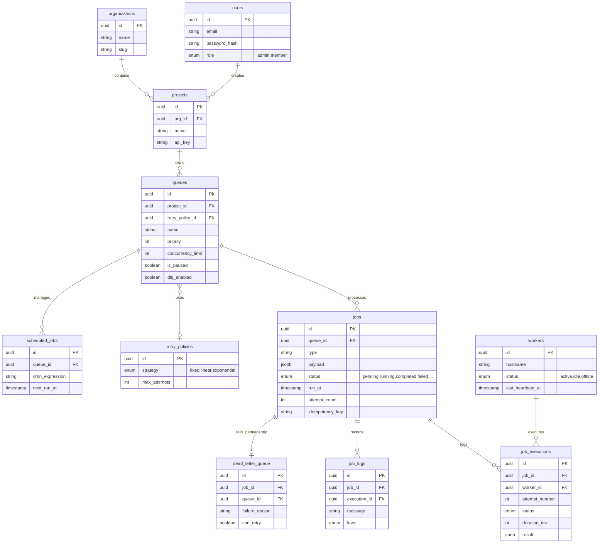

# Database Entity-Relationship Diagram

```mermaid
erDiagram
    users {
        uuid id PK
        string email
        string password_hash
        enum role "admin,member"
    }
    
    organizations {
        uuid id PK
        string name
        string slug
    }
    
    projects {
        uuid id PK
        uuid org_id FK
        string name
        string api_key
    }
    
    queues {
        uuid id PK
        uuid project_id FK
        uuid retry_policy_id FK
        string name
        int priority
        int concurrency_limit
        boolean is_paused
        boolean dlq_enabled
    }
    
    retry_policies {
        uuid id PK
        enum strategy "fixed,linear,exponential"
        int max_attempts
    }
    
    jobs {
        uuid id PK
        uuid queue_id FK
        string type
        jsonb payload
        enum status "pending,running,completed,failed,..."
        timestamp run_at
        int attempt_count
        string idempotency_key
    }
    
    job_executions {
        uuid id PK
        uuid job_id FK
        uuid worker_id FK
        int attempt_number
        enum status
        int duration_ms
        jsonb result
    }
    
    job_logs {
        uuid id PK
        uuid job_id FK
        uuid execution_id FK
        string message
        enum level
    }
    
    dead_letter_queue {
        uuid id PK
        uuid job_id FK
        uuid queue_id FK
        string failure_reason
        boolean can_retry
    }
    
    scheduled_jobs {
        uuid id PK
        uuid queue_id FK
        string cron_expression
        timestamp next_run_at
    }
    
    workers {
        uuid id PK
        string hostname
        enum status "active,idle,offline"
        timestamp last_heartbeat_at
    }
    
    users ||--o{ projects : creates
    organizations ||--o{ projects : contains
    projects ||--o{ queues : owns
    queues ||--o{ jobs : processes
    queues }o--o| retry_policies : uses
    jobs ||--o{ job_executions : logs
    jobs ||--o{ job_logs : records
    jobs ||--o| dead_letter_queue : fails_permanently
    queues ||--o{ scheduled_jobs : manages
    workers ||--o{ job_executions : executes
```
